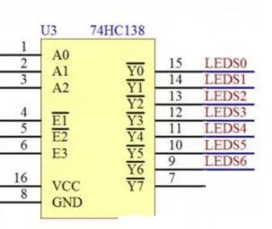
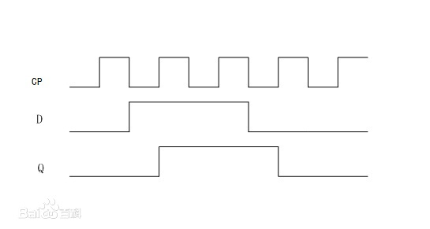
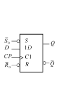
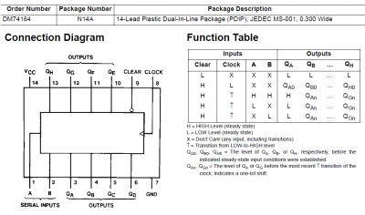
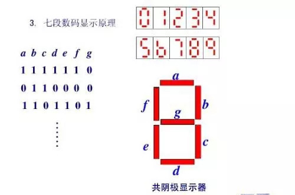

**1.** **什么是EDA？**

答：Electronic design automation，一般翻译为中文「电子设计自动化」 EDA技术就是以微电子技术为先导，现代电子技术为灵魂，计算软件技术为手段，最终形成集成电子系统或专用集成电路为目的的一种新兴技术。EDA技术就是依靠功能强大的电子计算机，在EDA工具软件平台上，对以硬件描述语言为系统逻辑描述手段完成的设计文件，自动地完成逻辑编译、化简、分割、综合、优化和仿真，直至下载到可编程逻辑器件CPLD/FPGA或专用集成电路ASIC芯片中，实现既定的电子电路设计功能。

极大地提高了设计效率，缩短了设计周期，节省了设计成本。

**2.** **什么是FPGA？**

答：FPGA（Filed Programmable Gate Array）：现场可编程逻辑门阵列。FPGA器件及其开发系统是开发大规模数字集成电路的新技术。它利用计算机辅助设计，绘制出实现用户逻辑的原理图、编辑布尔方程或用硬件描述语言等方式作为设计输入；然后经一系列转换程序、自动布局布线、模拟仿真的过程；最后生成配置FPGA器件的数据文件，对FPGA器件初始化。

**3.** **Quartus****的开发流程？**

答：①建立一个工程文件；

工程文件名应与实体名保持一致，以字母开头，不以下划线结尾。

②建立一个VHDL文件，输入程序文本并保存；

注意设计相应的VHDL文件为顶层实体。

③对VHDL程序进行编译，并在当前文件夹创建模型文件；

④建立一个原理图文件，插入刚刚建立的模型文件并保存；

注意保存名字不与实体名一样，否则会报错；

⑤设计该原理图文件为顶层实体，并进行编译；

⑥按照所给的说明书分配引脚；

⑦建立一个波形文件并保存，植入节点名，设计好波形进行仿真验证；

需先设置为功能性仿真，并产生一个功能仿真网络表，再运行仿真。

⑧若仿真验证通过，则再一次进行重新编译；

⑨若编译正确则会形成以sof、pof为后缀的下载文件；

⑩用JTAG口下载到FPGA进行结果验证。

**4.** **VHDL****的构成？**

答：一个VHDL设计由若干个VHDL文件构成，每个文件主要包含如下三个部分中的一个或全部：程序包、实体、结构体。

一个相对完整的VHDL程序，通常由库、程序包、实体、结构体、配置组成。语言特点是有并行语句和顺序语句组成。


## **（1）动态扫描VHDL描述语言（包含分频器、60倒计时计数器、动态扫描）：**

```vhdl
library ieee;

use ieee.std_logic_1164.all;

use ieee.std_logic_unsigned.all;

entity dtsm_all is

port(clk_50M:in std_logic;

   seg,dig:out std_logic_vector(7 downto 0);

   rb,en,load:in std_logic;

   a:in std_logic_vector(7 downto 0));

end dtsm_all;

architecture one of dtsm_all is

 signal daout:std_logic_vector(3 downto 0);

 signal q:std_logic_vector(7 downto 0);

 signal qg,qs:std_logic_vector(3 downto 0);

 signal clk_1,clk_1k,tclk_1,tclk_2:std_logic;

 signal cnt1:integer range 0 to 24999;

 signal cnt2:integer range 0 to 499;

 signal cnt8:std_logic_vector(2 downto 0);

 begin

 qg<=q(3 downto 0);

 qs<=q(7 downto 4);

 clk_1k<=tclk_1;

 clk_1<=tclk_2;

 P1:process(clk_50M)  --分频 50M

  begin

   if(clk_50M'event and clk_50M='1') then

   if(cnt1=24999) then

​    cnt1<=0;

​    tclk_1<=not tclk_1;

   else

​    cnt1<=cnt1+1;

   end if;

   end if;

  end process P1;  

P2:process(clk_1k)   -- 分频1k

  begin

   if(clk_1k'event and clk_1k='1') then

   if(cnt2=499) then

​    cnt2<=0;

​    tclk_2<=not tclk_2;

   else

​    cnt2<=cnt2+1;

   end if;

   end if;

  end process P2;  

P3:process(rb,clk_1,en,load,a)  

  begin

  if(rb='0') then q<="00000000";

  elsif(clk_1'event and clk_1='1') then 

   if(load='1') then q<=a;

   elsif(en='1') then q<=q-1;

   if(q<="00000000") then q<="00111011";

   end if; 

   end if;

  end if;

  end process P3; 

P4:process(cnt8,qg,qs)

  begin

   case cnt8 is

   when"000"=>dig<="11111110";daout<=qg;

   when"001"=>dig<="11111101";daout<=qs;

   when"010"=>dig<="11111011";daout<=qg;

   when"011"=>dig<="11110111";daout<=qs;

   when"100"=>dig<="11101111";daout<=qg;

   when"101"=>dig<="11011111";daout<=qs;

   when"110"=>dig<="10111111";daout<=qg;

   when"111"=>dig<="01111111";daout<=qs;

   when others=>null;

   end case;

 end process P4;

P5:process(clk_1k)

  begin

   if(clk_1k'event and clk_1k='1') then

   cnt8<=cnt8+1;

   end if;

  end process P5;

P6:process(daout)

  begin

  case daout is

   when"0000"=>seg<="11000000";

   when"0001"=>seg<="11111001";

   when"0010"=>seg<="10100100";

   when"0011"=>seg<="10110000";

   when"0100"=>seg<="10011001";

   when"0101"=>seg<="10010010";

   when"0110"=>seg<="10000010";

   when"0111"=>seg<="11111000";

   when"1000"=>seg<="10000000";

   when"1001"=>seg<="10010000";

   when"1100"=>seg<="10001000";

   when"1101"=>seg<="10000011";

   when"1110"=>seg<="10000110";

   when"1111"=>seg<="11000001";

   when others=>null;

  end case;

 end process P6;

end one;
```

## 编码器译码器

### **（2）3-8线译码器：**



注意需要使能  E1 E2 低电平 E3高电平

```vhdl
library ieee;
use ieee.std_logic_1164.all;

entity decoder38 is 
	port(
    en1,en2,en3,a1,a2,a3 : in std_logic;
    output : out std_logic_vector(7 downto 0)
	);
end entity;

architecture arch1 of decoder38  is
	signal address std_logic_vector(2 downto 0);
    begin process(en1,en2,en3,a1,a2,a3)
    	if(en1 = '0 && en2 = '0' & en3 = '0')
        	address <= a1&a2&a3;
            case address
            when "000" => output <= "11111110";
      		when "001" => output <= "11111101";
            when "010" => output <= "11111011";
            when "011" => output <= "11110111";
            when "100" => output <= "11101111";
            when "101" => output <= "11011111";
            when "110" => output <= "10111111";
            when "111" => output <= "01111111";          
            when
        else
        	output <= "11111111";
        end if
    end process;
end arch1;
```


### **（3）8-3线编码器**

```vhdl
library ieee;
use ieee.std_logic_1164.all;

entity encoder83 is
	port(
    	input: in std_logic_vector( 7 downto 0);
    	output : out std_logic_vector(2 downto 0);
    );
end encoder83;

architecture arch1 of encoder83 is
	begin 
    process(input)
    begin
    case input
    when "11111111" then output<="000";
    when "11111110" then output<="001";
    when "11111101" then output<="010";
    when "11111011" then output<="011";
    when "11110111" then output<="100";
    when "11101111" then output<="101";
    when "11011111" then output<="110";
    when "10111111" then output<="111";
	when others then null;
    end case;
    end process
end arch1;

```


 

 

### **（4）8-3线优先编码器**

```vhdl
-- Code your design here
library IEEE;
use IEEE.std_logic_1164.all;

entity encoder83 is
	port(
    	input : in std_logic_vector(7 downto 0);
        en1,en2,en3 : in std_logic;
        output : out std_logic_vector(2 downto 0)
    );
end encoder83;

architecture arch1 of encoder83
	p1: process(en1,en2,en3,input)
    begin
    if(en1 = '1' and en2 = '1' and en3 = '0')
    	if(input(0) = '1') then
        	output <= "000";
        end if;
        if(input(1) = '1') then
        	output <= "001";
        end if;
        if(input(2) = '1') then
        	output <= "010";
        end if;
        if(input(3) = '1') then
        	output <= "011";
        end if;
        if(input(4) = '1') then
        	output <= "100";
        end if;
        if(input(5) = '1') then
        	output <= "101";
        end if;
        if(input(6) = '1') then
        	output <= "110";
        end if;
        if(input(7) = '1') then
        	output <= "111";
        end if;
    else 
    	output <= "xxx"
    end if;
    end p1;
end arch1;
```


##  半加器 & 全加器 & 乘法器

### （5）半加器

```vhdl

library IEEE;
use IEEE.std_logic_1164.all;
use IEEE.std_logic_arith.all;
use IEEE.std_logic_unsigned.all;

entity half_add is
	port(
    	a,b : in std_logic;
        c,s : out std_logic;
    );
end half_add;

architecture arch1 of half_add is
	begin 
    p1: process(a,b)
    begin
    c <= a xor b;
    s <= a and b;
    end process p1;
end arch1;
```

### **（6）全加器**

```vhdl
library ieee;
use ieee.std_logic_1164.all;

entity full_adder is 
   	port(
    	a,b,cin in std_logic;
        s,c out std_loggic
    );
end full_adder;
    
architecture arch1 in full_adder is
	signal x std_logic_vector(2 downto 0);
    begin process(a,b,cin)
            x <= a&b&cin;
        case x is
            when"000"=>s<='0';cout<='0';

            when"100"=>s<='1';cout<='0';

            when"010"=>s<='1';cout<='0';

            when"110"=>s<='0';cout<='1';

            when"001"=>s<='1';cout<='0';

            when"101"=>s<='0';cout<='1';

            when"011"=>s<='0';cout<='1';

            when"111"=>s<='1';cout<='1';
        end case;
    end process;
end arch1;
```


### **（7）乘法器**

```vhdl
library ieee;

use ieee.std_logic_1164.all;

use ieee.std_logic_unsigned.all;

entity mul is

port(x1,x2:in std_logic_vector(2 downto 0);

   y:out std_logic_vector(5 downto 0));

end mul;

architecture one of mul is

begin

y<=x1*x2;

end one;
```

## 触发器

### **（8）JK触发器**

```vhdl
library ieee;
use iee.std_logic_1164.all;
entity JK_FF is 
    port(
    	J,K,CLK:in std_logic;
        Q,notQ:buffer std_logic
    );
end JK_FF;
    
architecture arch1 of JK_FF is
	signal P,notP : std_logic;
begin
    process(J,K,CLK)
    begin
    	P <= Q;
        notP <= notQ;
    	if( CLK event AND CLK = '1') then
          if(J = '0' AND K = '0') then
            P <= Q;
          	notP <= notQ;
          elsif (J = '1' AND K = '0') then
            P <= '1';
			notP <= '0';
          elsif (J = '0' AND K = '1') then
            P <= '0';
			notP <= '1';
          else
          	P <= not Q;
            notP <= not notQ;
        end if;
        Q <= P;
        notQ <= notP;
     end process;
end arch1;   

```


 

### D触发器：

$$
Q_{n+1}=D
$$






```vhdl
libarary ieee;
use ieee.std_logic_1164.all;

entity D_FF is
	port(
    	clk,D : in std_logic;
        Q,notQ : out std_logic
    );
end D_FF;

architecture arch1 of D_FF is 
	process(clk,D)
    begin
    if (clk 'event and clk = '1')
    	Q <= D;
        notQ <= not D;
    end if;
    end process
end arch1;
```


 

异步复位的D触发器：

```vhdl
libarary ieee;
use ieee.std_logic_1164.all;

entity D_FF is
	port(
    	clk,D,reset : in std_logic;
        Q,notQ : out std_logic
    );
end D_FF;

architecture arch1 of D_FF is 
	process(clk,D,reset)
    begin
    if(reset = '1') then --多了一个复位判断
    	Q <= '0';
        notQ <= '1';
    else
      if (clk 'event and clk = '1') then
          Q <= D;
          notQ <= not D;
      end if;
   	end if;
    end process
end arch1;
```


 

## **带使能端的8位可（不）移位寄存器**



```vhdl
library ieee;
use ieee.std_logic_1164.all;

entity shiftReg is
	port(
    	clk,en,load : in std_logic;
        D : in std_logic(7 downto 0);
        S : buffer std_logic(7 downto 0)
    );
end shiftReg;

architecture arch1 of shiftReg
	signal tmp : std_logic;
    begin 
    process(D,S,clk,en,load)
    begin
    	if(en = '1') then
          if (clk' event AND clk = '1') then
        	if(load = '1')
            	S <= D;
                tmp <= 0;
             elsif (load = '0')
                  tmp <= D(0);
                  S(6 downto 0) <= D(7 downto 1)
                  S(7) <= tmp;
             end if;
          end if;
        end if;
        
        if(en = '0') then
        	if(clk = '1') then
            	S <= D;
        	end if;
        end if;
    end process;
end arch1;
    
```


## **（10）8选1数据选择器**

```vhdl
library ieee;
use ieee.std_logic_1164.all

entity mux81 is
	port(
    	a,b,c : in std_logic;
        inputData : in std_logic_vector(7 downto 0);
        outputData : out std_logic
    );
end mux81;

architecture arch1 of mux81 is
	signal address : std_logic_vector(2 downto 0)
    begin
    begin process(a,b,c,inputData)
      address <= a&b&c;  //并列操作  只对vector有效
      case address is 
          when "000" => outputData <= inputData(0);
          when "001" => outputData <= inputData(1);
          when "010" => outputData <= inputData(2);
          when "011" => outputData <= inputData(3);
          when "100" => outputData <= inputData(4);
          when "101" => outputData <= inputData(5);
          when "110" => outputData <= inputData(6);
          when "111" => outputData <= inputData(7);
          when others => null;
      end case;
    end process;
end arch1;
```


## (11)60进制加计数器

```vhdl
library ieee;

use ieee.std_logic_1164.all;

use ieee.std_logic_unsigned.all;

entity jsq60 is

 port(clk,reset:in std_logic;

   dout:out std_logic_vector(7 downto 0));

 end jsq60;

 architecture one of jsq60 is

 signal sge:std_logic_vector(3 downto 0);

 signal sshi:std_logic_vector(3 downto 0);

  begin

  dout(7 downto 4)<=sshi;

  dout(3 downto 0)<=sge;

  process(clk,reset)

  begin

  if(reset='0') then

   sge<="0000";

   sshi<="0000";

  elsif(clk'event and clk='1') then 

   if(sshi<5) then

   if(sge=9) then

​    sge<="0000";

​    sshi<=sshi+1;

   else

​    sge<=sge+1;

   end if;

   else

   if(sge=9) then

​    sge<="0000";

​    sshi<="0000";

   else

​    sge<=sge+1;

​    end if;

   end if;

  end if;

 end process;

 end one;


```

 

## **与非门：**

```vhdl
-- Code your design here
library IEEE;
use IEEE.std_logic_1164.all;

entity nand_gate is
	port(
	input_1,intput_2 : in std_logic;
    output : out std_logic);
end nand_gate;

architecture arch1 of nand_gate is
	p1 process(input_1,input_2)
    begin
    output <= input_1 nand input_2;
    end p1
end arch1;
```


## **四位二进制加减器：**

```vhdl
libarary ieee;
use ieee.std_logic_1164.all;

entity binary_adder is
	port(
    	num1,num2 : in std_logic_vector(3 downto 0);
        isSub : in std_logic;
        ans : out std_logic_vector(4 downto 0)
    );
end binary_adder;

architecture arch1 of binary_adder is
	begin 
    process(num1,num2,isSub)
    signal exNum1,exNum2 std_logic_vector(4 downto 0)
    begin
    exNum1 <= '0'&num1;
    exNum2 <= '0'&num2;
    if (isSub = '1') then
    	ans <= exNum1 - exNum2;
    else
    	ans <= exNum1 + exNum2;
    end process
end arch1;
```


## 乘法器：乘法运算法则

```vhdl
library ieee;                             --调用库

use ieee.std_logic_1164.all; 

use ieee.std_logic_unsigned.all;

entity cfq is                                 --定义实体

 port( a,b:in std_logic_vector(2 downto 0);             --定义输入3位二进制数

​      y:out std_logic_vector(5 downto 0));            --定义输出6位二进制数

end cfq;                                    --结束实体

architecture a of cfq is                          --定义结构体，描述功能

​    signal temp1 :std_logic_vector (2 downto 0);         --定义信号1，3位二进制数

​    signal temp2 :std_logic_vector (3 downto 0);        --定义信号2，4位二进制数

​    signal temp3 :std_logic_vector (4 downto 0);      --定义信号3，5位二进制数

begin                                      --开始结构体

temp1<=a when b(0) = '1' else "000";      --当(0)位为1时，temp1赋值a，否则为000

temp2<=(a & '0') when b(1)='1' else "0000";--当b(1)位为1时，temp2赋值(a并置0)，否则为0000

temp3<=(a & "00") when b(2)='1' else "00000";--当b(2)位为1时，temp3赋值(a并置00)，否则为00000

​    y<=temp1+temp2+('0'&temp3);               --y赋值(temp1+temp2+(temp3并置0))

end a;
```


#### （2）直接相乘法：

```vhdl
library ieee;                             --调用库

use ieee.std_logic_1164.all; 

use ieee.std_logic_unsigned.all;

entity cfq is                                  --定义实体

 port( a,b:in std_logic_vector(2 downto 0);             --定义输入3位二进制数

​      y:out std_logic_vector(5 downto 0));            --定义输出6位二进制数

end cfq;                                    --结束实体

architecture a of cfq is                          --定义结构体，描述功能

begin                                      --开始结构体

 y<=a*b;                         --y=a*b

end a;
```


 

## **数码管动态扫描：**

### （1）单个计数器实现

```vhdl
-- Code your design here
library IEEE;
use IEEE.std_logic_1164.all;

entity counter is
	port(
    	clc,clk,en : in std_logic;
        output: out std_logic_vector
    );
end counter;

architecture arch1 is
    p1: process(clc,clk,en)
    begin 
    	if(en = '1')
        	if(clc = '1')
            	output <= "000";
            end if;
            if(clk ' event and clk = '1')
            	output <= output + '1';
            end if;
        end if;
	end p1;
end arch1;
```


### （3）计数和数码管同时



```vhdl
library ieee;     --调用库

use ieee.std_logic_unsigned.all;            

use ieee.std_logic_1164.all; 

use ieee.std_logic_arith.all;

entity Smg is   --定义实体

port( clk, clr , en: in std_logic;       --定义输入，描述计数器的变量

​    d0,d1,d2,d3,d4,d5,d6,d7: in std_logic_vector(3 downto 0); --定义输入，描述各个数码管显示的变量

​    seg : out std_logic_vector( 6 downto 0);     --定义输出，段选

​    scan: out std_logic_vector( 7 downto 0));    --定义输出，位选

end entity Smg;    --结束实体

architecture one of Smg is    --定义结构体，描述功能

signal count_3: std_logic_vector( 2 downto 0 );     --定义一信号变量，描述计数器值

signal data: std_logic_vector( 3 downto 0 );      --定义一信号变量，描述瞬时显示值

begin

   process (clk, clr) is    --第一个进程，描述计数器，敏感信号clk、clr

begin

if( clr='1' ) then   --如果clk为1，信号值归零

​     count_3<="000";

   elsif( clk 'event and clk = '1') then   --如果遇到时钟信号的上升沿

​     if ( en = '1' ) then         --且使能端为1

​       if( count_3 = "111" ) then    --如果信号值为“111”归零

​          count_3<="000";

​       else

​          count_3<=count_3+'1';    --否则加一

​       end if;    --结束if

     end if;    --结束if

   end if;      --结束if

   end process;    --结束此进程

  

  process ( count_3,d0,d1,d2,d3,d4,d5,d6,d7)   --第二个进程，描述段选，敏感信号为计数值与d0~d7

begin

   case count_3 is                --选择计数值

​     when "000" => scan <= "11111110"; data <= d0; --当计数值为0，段选赋值，瞬时显示值赋值

​     when "001" => scan <= "11111101"; data <= d1;

​      when "010" => scan <= "11111011"; data <= d2;

​     when "011" => scan <= "11110111"; data <= d3;

​     when "100" => scan <= "11101111"; data <= d4;

​     when "101" => scan <= "11011111"; data <= d5;

​     when "110" => scan <= "10111111"; data <= d6;   

​     when "111" => scan <= "01111111"; data <= d7;

​     when others => scan <= "11111111"; data <= d0; --当其他状况，段选全为一，不使能

   end case;   --结束选择

   end process; --结束此进程

   

   process (data)     --第三个进程，位选赋值，敏感信号为瞬时显示值

begin

   case data is      --选择瞬时显示值

​     when "0000" => seg <= "0111111";   --当瞬时显示值为“0000”，位选为“0111111”，显示0

​     when "0001" => seg <= "0000110";      --显示1

​     when "0010" => seg <= "1011011";   --显示2

​     when "0011" => seg <= "1001111";   --显示3

​     when "0100" => seg <= "1100110";   --显示4

​     when "0101" => seg <= "1101101";   --显示5

​     when "0110" => seg <= "1111101";   --显示6

​     when "0111" => seg <= "0000111";   --显示7

​     when "1000" => seg <= "1111111";   --显示8

​     when "1001" => seg <= "1100111";   --显示9

​     when "1010" => seg <= "1110111";   --显示a

​     when "1011" => seg <= "1111100";   --显示b

​     when "1100" => seg <= "0111001";   --显示c

​     when "1101" => seg <= "1011110";   --显示d

​     when "1110" => seg <= "1111001";   --显示e

​     when "1111" => seg <= "1110001";   --显示f

​     when others => seg <= "0000000";   --其他情况，位选为0，熄灭

   end case;   --结束选择

   end process;    --结束此进程

end architecture one;    --结束结构体
```


## 分频器

#### 8分频：

```vhdl
-- Code your design here
library IEEE;
use IEEE.std_logic_1164.all;
use IEEE.std_logic_arith.all;

entity divider_8 is 
	port(
    	clk_in : in std_logic;
    	clk_out: out std_logic;
    );
end divider_8

architecture arch1 of divider is
	signal cnt : std_logic_vector (2 downto 0);
    begin process(clk_in)
    if(cnt /= 3) then
    	cnt <= cnt+1;
    else 
    	cnt <= 0;
        clk_out <= not clk_out;
    end if;
    end process;
end arch1;
```


 

#### 10分频：

```vhdl
library ieee;          --调用库

use ieee.std_logic_1164.all;

use ieee.std_logic_arith.all;

use ieee.std_logic_unsigned.all;

entity SFP is          --定义实体

port( clk :in std_logic;       --定义输入

​    fout :out std_logic);   --定义输出

end SFP;             --结束实体

architecture one of SFP is    --定义结构体描述功能

   signal countq:std_logic_vector ( 3 downto 0); --定义一四位二进制信号

begin            --开始结构体

   process(clk)      --进程，敏感信号为输入

begin

   if clk'event and clk = '1' then   --如果输入发生在上升沿

​     if countq/=9 then      --如果信号值不为9

​       countq<=countq+1; --信号加一

​     else            

​       countq<=(others => '0' );    --否则信号归零   

​     end if;    --结束if

   end if;      --结束if

   end process;    --结束此进程

   process(countq)    --进程，敏感信号为信号变量

begin            --开始进程

   if countq<=1 then   --如果信号小于1

​     fout<='1';     --输出为高，即信号为0、1时输出为高

   else

​     fout<='0';     --否则输出为低，即信号为2、3、4、5、6、7、8、9时为低

   end if;        --结束if

   end process;      --结束进程

end one;          --结束结构体
```


 

#### 9分频：

奇数分频 一个上升沿触发  一个下降沿触发  两个时钟信号OR即可

```vhdl
library ieee;        --调用库

use ieee.std_logic_1164.all;

use ieee.std_logic_arith.all;

use ieee.std_logic_unsigned.all;

entity JFP is        --定义实体

port( clk :in std_logic;     --定义输入

​    fout :out std_logic); --定义输出

end JFP;          --结束实体

architecture one of JFP is    --定义结构体描述功能

   signal cnt1,cnt2 :integer range 0 to 8;  --定义两信号范围为0~8，即9个数，用于计数

   signal clk1,clk2:std_logic;   --定义两时钟信号，用于或运算

begin       --开始结构体

   process(clk)           --第一个进程，敏感信号为输入

begin

   if clk'event and clk = '1' then   --如果输入发生在上升沿

​     if cnt1 <8 then      --如果计数信号cnt1小于8

​       cnt1<=cnt1+1;   --cnt1加一

​     else            

​       cnt1<= 0;     --否则归零

​     end if;

​     if cnt1 <4 then      --如果计数信号小于4

​       clk1<='1';         --时钟信号1为高，即计数信号为0、1、2、3时为高

​     else

​       clk1<='0';         --否则为低，即技术信号为4、5、6、7、8时为低

​     end if;           --结束if

   end if;             --结束if

   end process;           --结束第一个进程

   

   process(clk)           --第二个进程，敏感信号为输入

begin     

   if clk'event and clk = '0' then   --如果输入发生在下降沿

​     if cnt2 <8 then      --如果计数信号cnt2小于8

​       cnt2<=cnt2+1;   --cnt2加一

​     else

​       cnt2<= 0;     --否则归零

​     end if;

​     if cnt2 <4 then      --如果计数信号小于4

​       clk2<='1';         --时钟信号2为高，即计数信号为0、1、2、3时为高

​     else

​       clk2<='0';         --否则为低，即技术信号为4、5、6、7、8时为低

​     end if;           --结束if

   end if;             --结束if

   end process;           --结束第二个进程

   

   fout <= clk1 or clk2;      --两个时钟信号相或，其中一个时钟信号相对于另一个时钟信号多出半个周期，相或高电平多半个周期实现50%分频

end one;      --结束结构体
```


  

#### 9分频（输出信号占空比为1/3）

```vhdl
library ieee;        --调用库

use ieee.std_logic_1164.all;

use ieee.std_logic_arith.all;

use ieee.std_logic_unsigned.all;

entity JFP is        --定义实体

port( clk :in std_logic;     --定义输入

   fout :out std_logic);    --定义输出

end JFP;          --结束实体

architecture one of JFP is  --定义结构体描述功能

  signal countq:std_logic_vector ( 3 downto 0); --定义一四位二进制信号

begin        --开始结构体

  process(clk)     --进程，敏感信号为输入

begin

  if clk'event and clk = '1' then   --如果输入发生在上升沿

​    if countq/=8 then     --如果信号值不为9

​      countq<=countq+1; --信号加一

​    else           

​      countq<=(others => '0' );   --否则信号归零 

​    end if;  --结束if

  end if;    --结束if

  end process;   --结束此进程

  process(countq)  --进程，敏感信号为信号变量

begin        --开始进程

  if countq<=2 then   --如果信号小于2

​    fout<='1';   --输出为高，即信号为0、1、3时输出为高

  else

​    fout<='0';   --否则输出为低，即信号为3、4、5、6、7、8时为低

  end if;      --结束if

  end process;     --结束进程

end one;         --结束结构体

 
```

